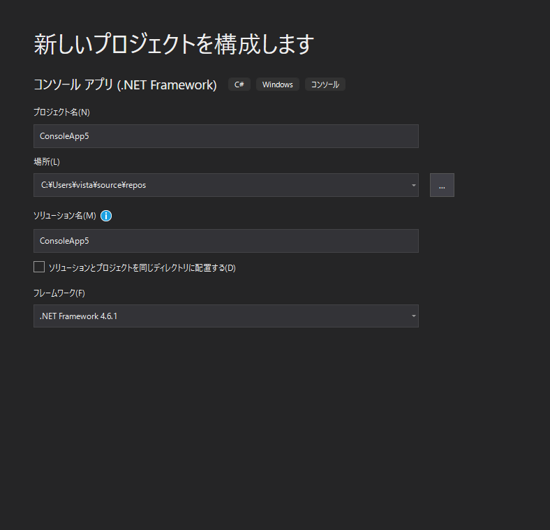
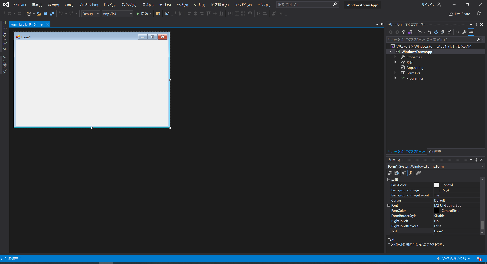

# Visual Studio & OpenCVSharp の環境構築 for セキュ実験後半組 Part1
## 1. はじめに  
* これはIEDでのWindows上の実験環境をローカル環境でも構築することを目的とした記事です。
* Visual StudioのバージョンがIEDと違う(IEDは2017、本記事は2019)など差異はありますが、実際にこの記事の手順で書いたプログラムをIED上のVisual Studioでコンパイルして動作することを確認しています。  
* Windows環境向けの記事です、MacOS、Linuxを使用の方はこの方法では動きません(そもそもVisual Studioがないし...)  Windows環境以外の方は別環境(Vim,VSCode,etc...)や別言語(C++,Python,etc...)でも実験の本質的なこと(OpenCVを動かす)は実行できます、ただフォームはIED上で作る必要があります この場合には使用するOpenCVのバージョンに気を付けてください(本実験ではOpenCVSharp2.4.10を使用しています)
* この記事はPart1です、Visual Studioのインストールを解説します。Part2ではOpenCVSharpの使用方法を解説する予定です。

## 2. これすると何がいいの？
* 自前のPCで実験課題ができる
* 予習ができる
* (もし遠隔になってもそんな困らない？)

## 3. インストール方法
### 3.1 ダウンロード
MicrosoftのホームページにあるVisual Studio 2019のダウンロードサイト  
[https://visualstudio.microsoft.com/ja/downloads/](https://visualstudio.microsoft.com/ja/downloads/)  
にアクセスし、コミュニティの下にある無料ダウンロードをクリックしてください。ダウンロードが始まります。  
### 3.2 インストール
ダウンロードしたインストーラー(vs_Community.exe)を起動し、ユーザーアカウント制御を許可し、Visual Studio Installerの画面で続行を押すとVisual Studio Installerのダウンロードが始まり、終わると以下の画面になります。

  
上図のように「.NETデスクトップ開発」にチェックを入れ、右下のインストールを押します。6.5GB程度使うので要注意です...

  
インストールが終わると上図のような画面になります、ここでは「後で行う」をクリックしてください。
  
配色テーマが設定できます。好きな配色にチェックを入れ、「Visual Studio の開始」をクリックします。  
### 3.3 Visual Studioの 実行
  
上図のような画面が出てくるので、右下の「新しいプロジェクトの作成」をクリックします。
#### 3.3.1 コンソールアプリケーションの場合
  
~~コンソールアプリケーションが作りたい場合は上図の「コンソール アプリケーション」とある左にC#と書かれている所をクリックし次へ、~~  
(2021/5/11修正:)コンソールアプリケーションが作りたい場合は上図の「コンソール アプリ(.NET Framework)」とある左にC#と書かれている所をクリックし次へ  
  
プロジェクト名と場所、ソリューション名を適当に決め、フレームワークを「.NET Freamwork 4.6.1」に指定し次へ、

とするとコードが書けます！

#### 3.3.2 Windows フォームアプリケーションの場合

Windows フォームアプリケーションが作りたい場合は上図の「Windows フォームアプリケーション(.NET Framework)」とある左にC#と書かれている所をクリックし次へ、  
  
プロジェクト名、場所、ソリューション名を適当に決め、フレームワークを「.NET Freamwork 4.6.1」に指定し次へ、
  
このようなウィンドウが出てくるので画面右の「ソリューション エクスプローラー」タブの「Prpgram.cs」をダブルクリックすると
  
コードが書けます！！！お疲れさまでした！！！！！！（戦いは始まったばかり）

part2へつづく