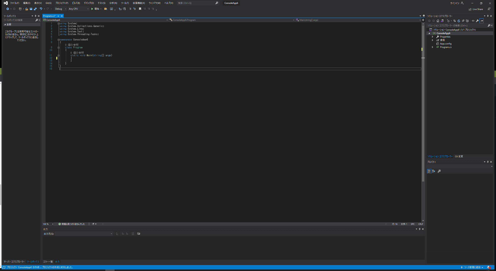

# Visual Studio & OpenCVSharp の環境構築 for セキュ実験後半組 Part2
← [part1](./part1.md) [part3](./part3.md) →
## 1. はじめに
* この記事は[part1](./part1.md)を読み、環境構築を済ませた前提で書いています。ただIED環境でもほぼ同じだと思います...

## 2. 今回は
* 「コンソール アプリ(.NET Framework)」テンプレートを用いてOpenCVSharpを使用する環境構築の仕方を紹介します。Part3では「Windows フォームアプリケーション」テンプレートを用いてOpenCVSharpを使用します。

## 3. Hello world!
  
Part1の3.3.1を参考に、コンソール アプリ(.NET Framework)テンプレートでコードが書ける状態にしてください。
  
上図のように、static void Main(string[] args){}の{}の間に

Console.WriteLine("Hello world!");  
Console.ReadKey();  

の二行を入れます。  
そして上部分の四角で囲んだ「▷ ConsoleApp3」(ConsoleApp3はプロジェクト名によって異なります)を押してプログラムを実行してみましょう！
 
コンソールに「Hello world!」と表示されてますね！  
以上の方法で、C#で書かれたプログラムを実行することができます！
## 4. OpenCVSharpの使用
次はOpenCVSharpを使用する方法を学んでみましょう！  
事前にWebClassからOpenCVSharp 2.4.10をダウンロードしておいてください。  
  
中にある上図のファイルをすべてプロジェクトフォルダ内の"bin/Debug"内にコピーしてください。  
  
プロジェクトフォルダの場所がわからない場合は、ソリューションエクスプローラー内のプロジェクト名を右クリックし、「エクスプローラーでフォルダを開く」をクリックするとディレクトリが表示されます！  
  
bin/Debug 内が上図のようになっていることを確認してください。  
  
ここまで出来たら、次に画面上「プロジェクト」タブから、「プロジェクト参照の追加」をクリックします。  
  
上図のようなウィンドウが出てきたら、左の「参照」タブをクリックし、右下の「参照」ボタンをクリックします。  
  
先ほどOpenCVSharpをコピーしたディレクトリ(bin/Debug)に移動し、OpenCVSharp.dllを選択して右下の「追加」ボタンをクリックします。
  
上図のようになったら、右下の「OK」ボタンをクリックしてください。  
後は講義資料のP71~73の指示に従ってコードを書き、実行するとOpenCVSharpが使用できるかテストできます！  

← [part1](./part1.md) [part3](./part3.md) →