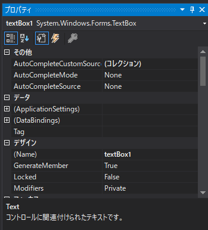

# Visual Studio & OpenCVSharp の環境構築 for セキュ実験後半組 Part3
← [part2](./part2.md)

## 1.はじめに
* たぶん最終回です
* この記事は[part1](./part1.md)を読み、環境構築を済ませた前提で書いています。ただIED環境でもほぼ同じだと思います...

## 2. 今回は
* 「Windows フォームアプリケーション」テンプレートを用いてOpenCVSharpを使用する環境構築の仕方を紹介します。

## 3. Hello world!
Part1の3.3.2を参考に、Windows フォームアプリケーション テンプレートでコードが書ける状態にしてください。
  
上図の左側にある「ツールボックス」を押してください。  
  
「すべてのWindows フォーム」の左側にある▷を押し  
  
「TextBox」をダブルクリックすると、マウスのポインタが変わるのでフォーム内の適当な場所をクリックすると  
  
このようにテキストボックスが作れます！  
  
右下のオプションで今作ったTextBoxのオプションが弄れます、「(Name)」の内容は使うので覚えておきましょう  
  
ソリューション エクスプローラから「Form1.cs/Form1/Form1()」をダブルクリックすると  
  
Form1.csが弄れます！Form1の内容を上図のように設定し

  
「▷開始」を押すと  
  
「Form1」というウィンドウが表示され、真ん中のTextBoxに「Hello world!」と書かれていますね！ここまでできれば成功です！
## 4. OpenCVSharpの使用
次はOpenCVSharpを使用する方法を学んでみましょう！  
  
事前にPart2と同様にWebClassからダウンロードしたOpenCVSharp2.4.10の中身をすべてプロジェクトフォルダ内の"bin/Debug"内にコピーしてください。  
  
参照は"OpenCVSharp.dll","OpenCVSharp.CPlusPlus.dll","OpenCVSharp.Extensions.dll"のすべてを参照してください。  
  
ツールボックス/すべてのWindows フォーム/PictureBoxを選択して作成すると
  
上図のようなボックスが作成されます。  
  
大きさを適当に決めて  
  
Form1.csを上図のように書いて  

  
開始を押すと

  

このようなウィンドウが出れば成功です！お疲れさまでした！（戦いはこれから）

← [part2](./part2.md)  
